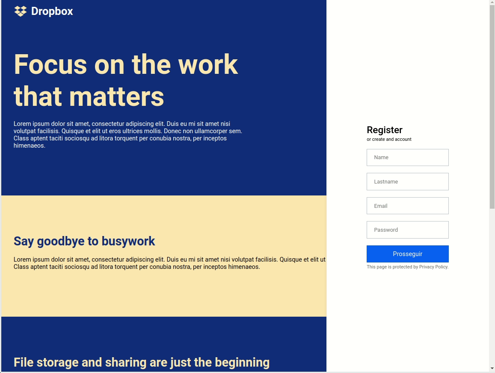

<h1 align="center">  
    
</h1>

<h4 align="center">
  Dropbox - UI Clone
</h4>

<p align="center">
  <a href="#project">Project</a>&nbsp;&nbsp;&nbsp;|&nbsp;&nbsp;&nbsp;
  <a href="#rocket-techs">Techs</a>&nbsp;&nbsp;&nbsp;|&nbsp;&nbsp;&nbsp;
  <a href="#rocket-Running">Running</a>&nbsp;&nbsp;&nbsp;|&nbsp;&nbsp;&nbsp;
</p>
<br>

## 💻 Project

 UI Clone of Dropbox. This project was created to training some CSS Skills and, besides that, to make the Menu change color depending on the section you are in.


## :rocket: Techs

- [Typescript](https://www.typescriptlang.org/)
- [ReactJS](https://reactjs.org/)


## :notebook: Running

### Requeriments

```bash
# Clone this
$ git clone https://github.com/glauberbrack/dropbox-ui-clone

# Go to your project folder
$ cd dropbox-ui-clone

# Install all depencies
$ yarn

# Run your project
$ yarn start
```

---

☕ Glauber Brack - <a href="mailto:glauber@brack.com.br?Subject=Hello%20you">Don't be shy, talk to me! (: </a> 